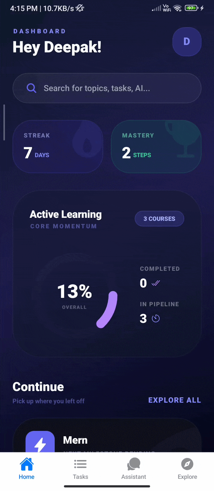
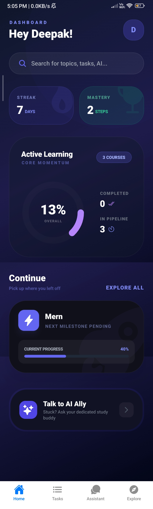
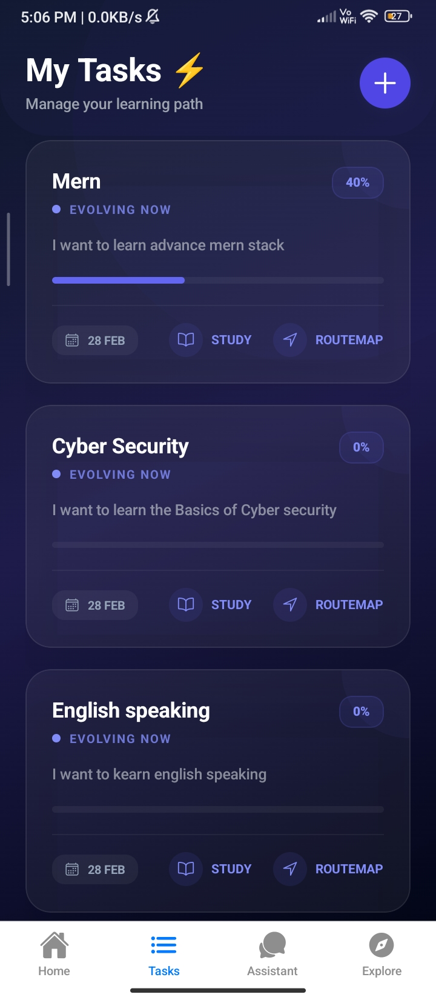
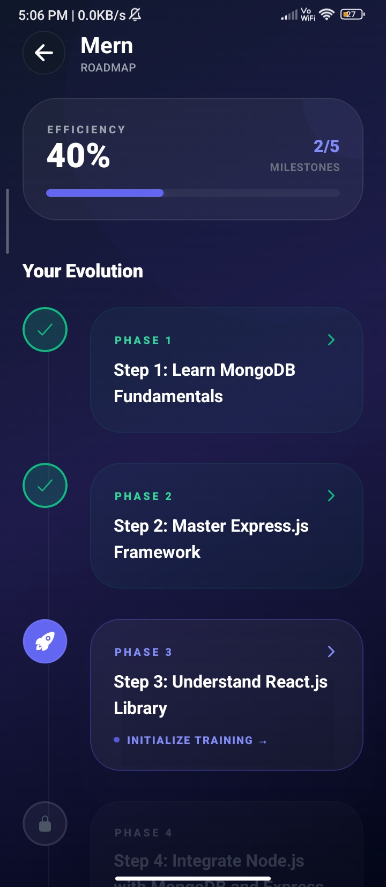
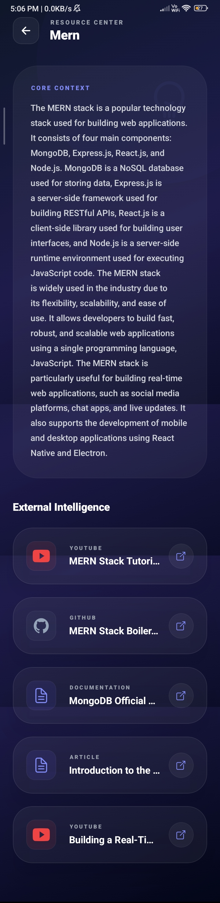
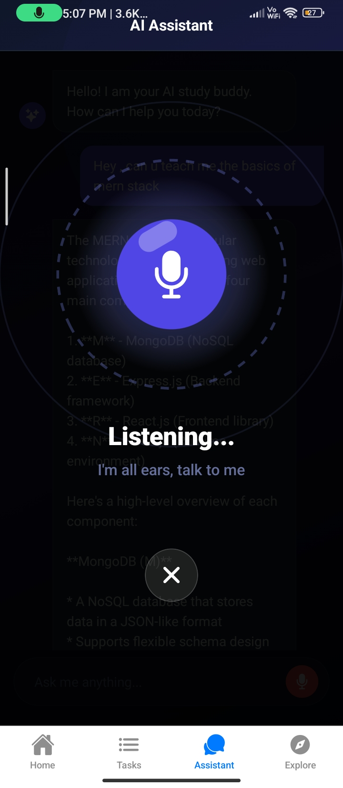
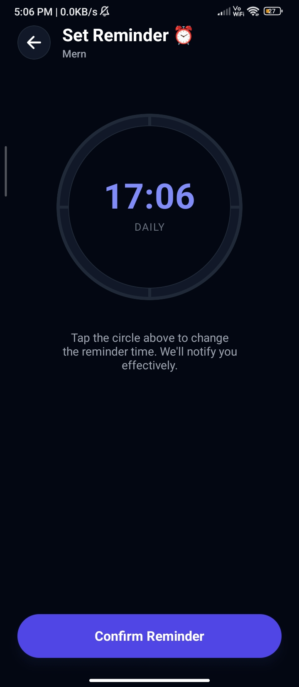

# 📚 Study Buddy – Smart Study Planner

<p align="center">


</p>

<p align="center">
A smart mobile application that helps students plan their study schedule, track progress, and improve productivity with AI-powered assistance.
</p>

---

# 🚀 Project Overview

**Study Buddy** is a **mobile study planner application** designed to help students manage their learning effectively.

The app allows users to:

* Break large learning goals into **manageable milestones**
* Track their **study progress**
* Practice **MCQ tests**
* Access **study materials**
* Get assistance from an **AI-powered study assistant**

This project was developed as a **Semester 6 Project**.

---

# 🎥 App Demo



# 📱 Download APK

<p align="center">

[](https://github.com/DeepakPandey2005/Studdy-Buddy/releases/download/v1.0/application-e715f7a2-d1ed-4969-930c-2f0b89c147f3.apk)

</p>

---

# ✨ Features

### 📌 Smart Study Roadmap

Breaks large study goals into **small achievable milestones**.

### 📖 Study Materials

Provides **learning resources and notes** inside the app.

### 🧠 MCQ Practice Tests

Students can test their knowledge with **practice quizzes and MCQs**.

### 📊 Progress Tracking

Track completed tasks and monitor **learning progress visually**.

### ⏰ Smart Reminders

Notifications for **pending tasks and upcoming milestones**.

### 🤖 AI Assistant

Integrated AI assistant that helps with:

* Study guidance
* Concept explanations
* Doubt solving
* Voice & text interaction

### 🔐 Secure Authentication

User authentication implemented with **JWT-based security**.

### ⚡ High Performance

Redis is used for **caching MCQ data and frequently accessed resources**.

---

# 🏗️ System Architecture

```
Mobile App (React Native + Expo)
            |
            |
      REST API (Node.js + Express)
            |
            |
      MongoDB Database
            |
            |
         Redis Cache
```

The backend is deployed on an **Azure Virtual Machine** using:

* **Docker**
* **Nginx Reverse Proxy**

---

# 🛠️ Tech Stack

## 📱 Mobile App

* React Native
* Expo
* Redux
* Tailwind CSS

## 🖥 Backend

* Node.js
* Express.js
* MongoDB
* Redis
* JWT Authentication

## ☁️ DevOps & Deployment

* Azure Virtual Machine
* Docker
* Nginx
* REST APIs

---

# ⚙️ Installation Guide

## 1️⃣ Clone Repository

```bash
git clone https://github.com/yourusername/study-buddy.git
cd study-buddy
```

---

## 2️⃣ Backend Setup

```
cd server
npm install
```

Create `.env`

```
PORT=5000
MONGO_URI=your_mongodb_connection
JWT_SECRET=your_secret
REDIS_URL=your_redis_url
```

Run server

```
npm run dev
```

---

## 3️⃣ Mobile App Setup

```
cd client
npm install
```

Start Expo

```
npx expo start
```
# 🎯 Project Goals

The main goal of this project is to help students:

* Organize their study schedules
* Improve learning efficiency
* Track progress systematically
* Get AI-powered learning assistance

---

# 👨‍💻 Author

**Deepak Pandey**

BSc Computer Science Student
Full Stack Developer | MERN Stack | React Native

🌐 Portfolio
[https://deepak-info.vercel.app](https://deepak-info.vercel.app)

💼 LinkedIn
[https://linkedin.com/in/deepak-pandey-189a2631b](https://linkedin.com/in/deepak-pandey-189a2631b)

💻 GitHub
[https://github.com/deepakpandey2005](https://github.com/deepakpandey2005)

---

# ⭐ Support

If you like this project, please **give it a star ⭐ on GitHub**.

---

# 📜 License

This project is licensed under the **MIT License**.

---

## 📸 App Screenshots

<p align="center">






</p>

<p align="center">



</p>
